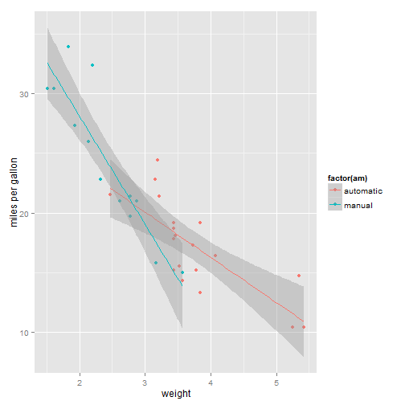
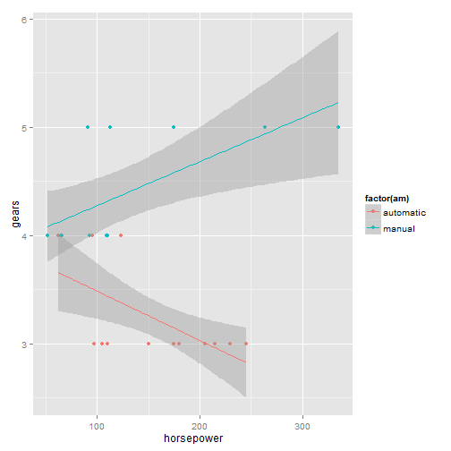

# Developing Data Products Project: Slidify

## Author: Markras

## Date: 25/09/2015

--- .class #id 

## Introduction to the Shiny Coursera Application

### The goal of the Shiny application delivered in the previous task is, as explained in the documentation, to evaluate the relationship between two variables of the mtcars dataset. The third variable "am" standing for manual or automatic transmission is predefined. 

### The tool allow you to:

+ Better understand the shape of mtcars dataset
+ Evaluate the impact of am on cars' performance
+ Visualize the aforementioned relationship

### Let's see some examples

--- .class #id 

### Example 1: relationship between weight and miles per gallon

 

--- .class #id 

### Example 1: relationship between horsepower and number of gears

 

--- &radio
## Quiz 
With this application you can quickly visualize linear regression depending on the mode of transmission in a given car. Is it awesome?

1. No?
2. _It's fantastic!_
3. It's a useless crap
4. _It's crazy how good this app is!_

***.hint 
It's phenomenal! 
***.explanation 
Use it and you'll see! 
